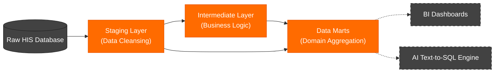

# Healthcare Data Warehouse (dbt) 

This repository contains the Data Engineering pipeline and **dbt (Data Build Tool)** configurations used to build a robust, high-performance Data Warehouse for a Hospital Information System (HIS).

### The Architecture Simplification
The core objective of this project is to take a massively complex transactional database and transform it into a clean, reliable, and decoupled analytics schema. Through this strict dbt pipeline, we achieve a massive structural simplification:

> [!IMPORTANT]  
> **94.6% Reduction in Schema Complexity**  
> We successfully compressed **245 raw operational tables** down to just **13 semantically rich Data Marts**, perfectly optimized for downstream analytical consumption.

- **28 Staging Models (`stg_`):** Isolating, renaming, and cleaning only the raw tables strictly necessary for analytics.
- **4 Intermediate Models (`int_`):** Modularizing heavy, reusable business logic and historical metric calculations.
- **13 Data Marts (`mart_`):** The final, heavily denormalized, domain-specific tables (e.g., outpatient visits, inpatient beds).

### The Critical Benefit for AI (RAG & Text-to-SQL)

> [!TIP]
> **Zero-Hallucination AI Architecture**  
> Large Language Models (LLMs) hallucinate when forced to write SQL against 245-table schemas requiring complex joins. By hiding the complexity and exposing only 13 pre-joined Data Marts, the AI maps user questions perfectly. This architecture results in **100% accurate SQL generation and sub-second execution times.**

While traditional Business Intelligence (BI) tools benefit greatly from this architecture, it is an absolute necessity for our downstream AI Engine.

---

## Key Engineering Highlights

### 1. Modular Data Modeling
- **Staging Layer:** Raw tables from the public transactional schema are cleaned, cast to appropriate types, and renamed (e.g., `stg_pacientes`, `stg_consultas`).
- **Intermediate Layer:** Complex business logic (such as calculating active hospital stays or medication baselines) is processed in DRY, modular intermediate models.
- **Data Marts:** The final output layer aggregates data into domain-specific tables (e.g., `mart_ocupacion_camas`, `mart_consultas_diarias`).

### 2. Lambda Architecture Implementation
We have successfully implemented a **Lambda Architecture** pattern using dbt. 
- **Batch Processing:** Heavy, historical metric calculations are run asynchronously on a daily basis.
- **Speed/Incremental Processing:** Real-time and near-real-time requirements (like live active hospital beds and daily diagnostic counts) are handled using lightweight views and incremental materializations. This guarantees that consumers always have up-to-date operational data without overloading the database with heavy recomputations.

### 3. High-Performance Materializations
To prevent query timeouts on large datasets, this project leverages advanced materialization strategies:
- **Materialized Views:** Heavy joins crossing multiple transactional domains are materialized for sub-second read performance.
- **Incremental Models:** Massive pipelines (like dispensing logs and anomaly detection) append only new daily records, reducing transformation times.
- **Custom Update Scripts:** Maintenance utilities like `update_dbt_views_manual.sql` allow for flexible data refreshes without full pipeline orchestration.

### 4. Automated Data Quality Testing
Critical constraints such as `not_null` and `unique` on patient identifiers and transaction codes are enforced through dbt tests, ensuring downstream consumers receive reliable data.

---

## Downstream Consumers

By exposing a dedicated, highly optimized `dbt_analytics` schema, the project enables integration with multiple downstream consumers:
- **Business Intelligence:** Tableau / PowerBI dashboards connect directly to the Data Marts for metric reporting.
- **AI Engine (Text-to-SQL):** An LLM-powered assistant (RAG) queries the Data Marts using the semantic definitions and catalog descriptions generated by `dbt docs generate`.

---

## Infrastructure & Security

- **Strict Separation of Concerns:** The analytics pipeline runs on an asynchronous replica database (`demo_db`) to ensure zero performance impact on the operational HIS.
- **Role-Based Access Control (RBAC):** Downstream consumers (like the AI Engine's `gemma` user) are granted strictly **read-only** access to the `dbt_analytics` schema, preventing data corruption.
